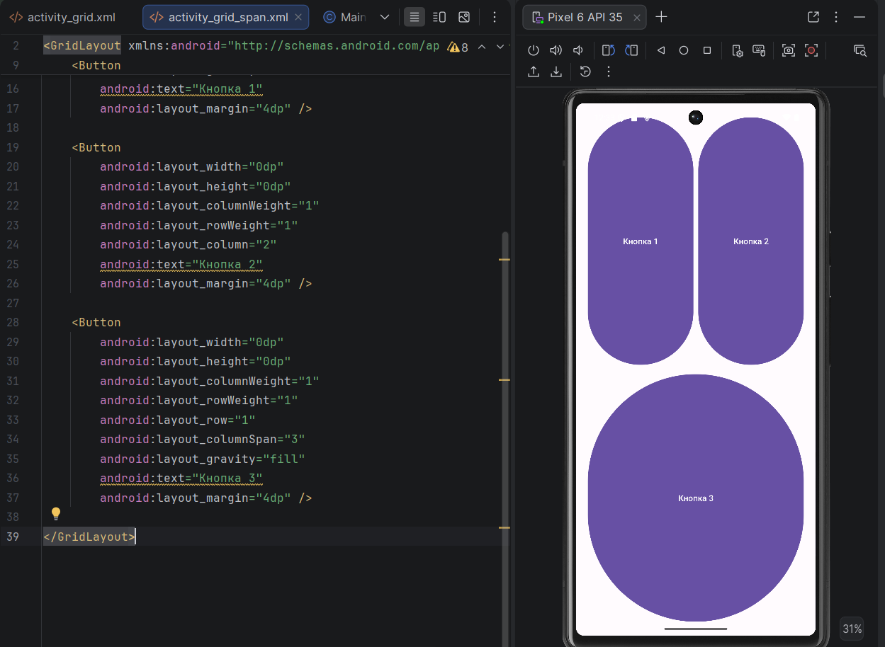
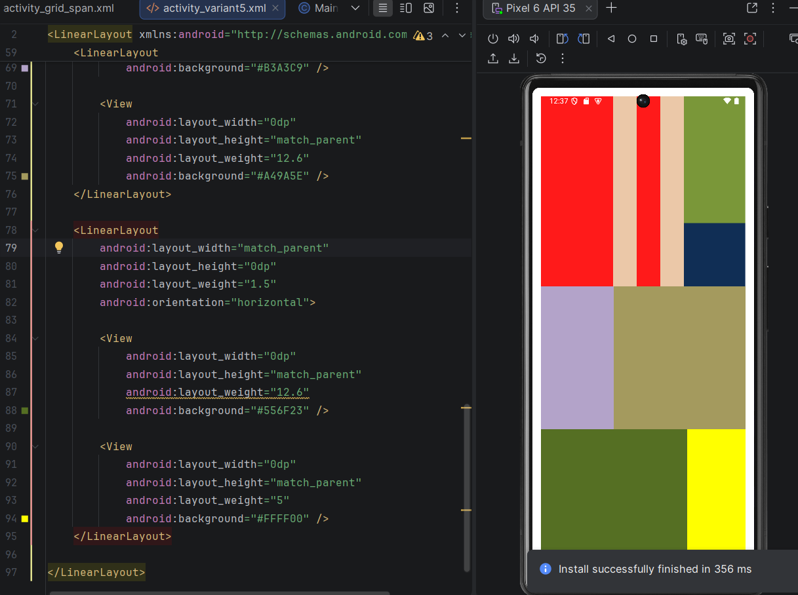

<div align="center">

# Отчет

</div>

<div align="center">

## Практическая работа №2

</div>

<div align="center">

## Основы XML-разметки. Менеджеры размещения LinearLayout и GridLayout

</div>

**Выполнил:**  
Ткачев Сергей Юрьевич  
**Курс:** 2  
**Группа:** ИНС-б-о-24-2  
**Направление:** ИПИНЖ (Институт перспективной инженерии)  
**Профиль:** Информационные системы и технологии  
**Вариант:** 5  

---

### Цель работы

Изучить основы языка разметки XML для описания пользовательского интерфейса Android-приложений. Научиться использовать менеджеры размещения `LinearLayout` и `GridLayout` для создания сложных экранов. Освоить основные атрибуты `View` и создание простых `Drawable`-ресурсов.

### Ход работы

#### 1. Создание проекта и подготовка ресурсов

В начале выполнения практической работы был создан новый проект с шаблоном **Empty Views Activity** под названием `LayoutsLab`. После этого была изучена структура проекта и подготовлены необходимые ресурсы для дальнейшей работы.

В папке `res/drawable` были созданы два XML-файла: `rectangle.xml` и `circle.xml`. Эти файлы предназначены для описания простых графических фигур средствами XML-разметки.

<div align="center">


*Рисунок 1. Создание файлов `rectangle.xml` и `circle.xml`*

</div>

#### Листинг 1. Содержимое файла `rectangle.xml`

```xml
<?xml version="1.0" encoding="utf-8"?>
<shape xmlns:android="http://schemas.android.com/apk/res/android"
    android:shape="rectangle">

    <solid android:color="#FF0000" />
    <corners android:radius="10dp" />
    <stroke
        android:width="2dp"
        android:color="#000000" />
</shape>
```

#### Листинг 2. Содержимое файла `circle.xml`

```xml
<?xml version="1.0" encoding="utf-8"?>
<shape xmlns:android="http://schemas.android.com/apk/res/android"
    android:shape="oval">

    <solid android:color="#0000FF" />
    <size
        android:width="100dp"
        android:height="100dp" />
</shape>
```

#### 2. Работа с LinearLayout

На следующем этапе был открыт файл `activity_main.xml`. Корневой контейнер `ConstraintLayout` был заменён на `LinearLayout`. Затем был создан вертикальный контейнер `LinearLayout`, внутри которого размещены три элемента `ImageView`, отображающие созданные ранее drawable-ресурсы.

В результате на экране приложения отобразились три фигуры: прямоугольник, круг и снова прямоугольник, причём последний элемент был повёрнут на 45 градусов.

<div align="center">


*Рисунок 2. Результат отображения фигур в `LinearLayout`*

</div>

#### Листинг 3. Разметка файла `activity_main.xml` для задания с `LinearLayout`

```xml
<?xml version="1.0" encoding="utf-8"?>
<LinearLayout xmlns:android="http://schemas.android.com/apk/res/android"
    android:id="@+id/main"
    android:layout_width="match_parent"
    android:layout_height="match_parent"
    android:orientation="vertical"
    android:gravity="center_horizontal"
    android:padding="16dp">

    <ImageView
        android:layout_width="100dp"
        android:layout_height="100dp"
        android:src="@drawable/rectangle"
        android:layout_marginBottom="16dp" />

    <ImageView
        android:layout_width="100dp"
        android:layout_height="100dp"
        android:src="@drawable/circle"
        android:layout_marginBottom="16dp" />

    <ImageView
        android:layout_width="100dp"
        android:layout_height="100dp"
        android:src="@drawable/rectangle"
        android:rotation="45" />

</LinearLayout>
```

#### 3. Изменение ориентации и выравнивания

Далее были выполнены действия по изменению ориентации и выравнивания элементов в контейнере `LinearLayout`.

Сначала атрибут `android:orientation` был изменён с `vertical` на `horizontal`, в результате чего элементы стали располагаться горизонтально.

<div align="center">


*Рисунок 3.1. Горизонтальное расположение элементов*

</div>

После этого для контейнера был добавлен атрибут `android:layoutDirection="rtl"`, благодаря чему элементы начали отображаться справа налево.

<div align="center">


*Рисунок 3.2. Расположение элементов справа налево*

</div>

На заключительном этапе ориентация была возвращена к вертикальной, а также были изменены атрибуты `android:gravity` у родительского контейнера и `android:layout_gravity` у дочернего элемента. Это позволило на практике изучить разницу между выравниванием содержимого внутри контейнера и выравниванием самого элемента внутри родителя.

<div align="center">


*Рисунок 3.3. Изменение выравнивания элементов*

</div>

#### 4. Работа с GridLayout

Для изучения менеджера размещения `GridLayout` был создан новый XML-файл разметки `activity_grid.xml`. В нём была реализована таблица кнопок размером **3×3**.

Каждая кнопка размещалась в отдельной ячейке сетки. Для равномерного распределения пространства использовались атрибуты `layout_columnWeight` и `layout_rowWeight`.

<div align="center">


*Рисунок 4. Результат работы `GridLayout` 3×3*

</div>

#### Листинг 4. Содержимое файла `activity_grid.xml`

```xml
<?xml version="1.0" encoding="utf-8"?>
<GridLayout xmlns:android="http://schemas.android.com/apk/res/android"
    android:id="@+id/main"
    android:layout_width="match_parent"
    android:layout_height="match_parent"
    android:columnCount="3"
    android:rowCount="3"
    android:padding="16dp">

    <Button
        android:layout_width="0dp"
        android:layout_height="0dp"
        android:layout_columnWeight="1"
        android:layout_rowWeight="1"
        android:text="1"
        android:layout_margin="4dp" />

    <Button
        android:layout_width="0dp"
        android:layout_height="0dp"
        android:layout_columnWeight="1"
        android:layout_rowWeight="1"
        android:text="2"
        android:layout_margin="4dp" />

    <Button
        android:layout_width="0dp"
        android:layout_height="0dp"
        android:layout_columnWeight="1"
        android:layout_rowWeight="1"
        android:text="3"
        android:layout_margin="4dp" />

    <Button
        android:layout_width="0dp"
        android:layout_height="0dp"
        android:layout_columnWeight="1"
        android:layout_rowWeight="1"
        android:text="4"
        android:layout_margin="4dp" />

    <Button
        android:layout_width="0dp"
        android:layout_height="0dp"
        android:layout_columnWeight="1"
        android:layout_rowWeight="1"
        android:text="5"
        android:layout_margin="4dp" />

    <Button
        android:layout_width="0dp"
        android:layout_height="0dp"
        android:layout_columnWeight="1"
        android:layout_rowWeight="1"
        android:text="6"
        android:layout_margin="4dp" />

    <Button
        android:layout_width="0dp"
        android:layout_height="0dp"
        android:layout_columnWeight="1"
        android:layout_rowWeight="1"
        android:text="7"
        android:layout_margin="4dp" />

    <Button
        android:layout_width="0dp"
        android:layout_height="0dp"
        android:layout_columnWeight="1"
        android:layout_rowWeight="1"
        android:text="8"
        android:layout_margin="4dp" />

    <Button
        android:layout_width="0dp"
        android:layout_height="0dp"
        android:layout_columnWeight="1"
        android:layout_rowWeight="1"
        android:text="9"
        android:layout_margin="4dp" />

</GridLayout>
```

#### 5. Объединение ячеек в GridLayout

Следующим этапом было выполнено задание на объединение ячеек. Для этого использовались атрибуты `android:layout_columnSpan` и `android:layout_row`.

В результате была создана разметка, в которой:
- первая кнопка занимала две ячейки по горизонтали;
- вторая кнопка располагалась в оставшейся ячейке первой строки;
- третья кнопка занимала всю ширину второй строки.

<div align="center">



*Рисунок 5. Объединение ячеек в `GridLayout`*

</div>

#### Листинг 5. Пример объединения ячеек в `GridLayout`

```xml
<?xml version="1.0" encoding="utf-8"?>
<GridLayout xmlns:android="http://schemas.android.com/apk/res/android"
    android:layout_width="match_parent"
    android:layout_height="match_parent"
    android:columnCount="3"
    android:rowCount="2"
    android:padding="16dp">

    <Button
        android:layout_width="0dp"
        android:layout_height="0dp"
        android:layout_columnWeight="1"
        android:layout_rowWeight="1"
        android:layout_columnSpan="2"
        android:layout_gravity="fill"
        android:text="Кнопка 1"
        android:layout_margin="4dp" />

    <Button
        android:layout_width="0dp"
        android:layout_height="0dp"
        android:layout_columnWeight="1"
        android:layout_rowWeight="1"
        android:layout_column="2"
        android:text="Кнопка 2"
        android:layout_margin="4dp" />

    <Button
        android:layout_width="0dp"
        android:layout_height="0dp"
        android:layout_columnWeight="1"
        android:layout_rowWeight="1"
        android:layout_row="1"
        android:layout_columnSpan="3"
        android:layout_gravity="fill"
        android:text="Кнопка 3"
        android:layout_margin="4dp" />

</GridLayout>
```

#### 6. Задание для самостоятельного выполнения

Согласно варианту 5 была реализована композиция по **рисунку 13** из методических указаний. Для построения интерфейса использовались контейнеры `LinearLayout` и простые элементы `View` с различными цветами фона. Разметка была составлена таким образом, чтобы получить расположение цветных блоков, соответствующее требуемому образцу.

<div align="center">



*Рисунок 6. Результат выполнения задания по варианту 5*

</div>

#### Листинг 6. XML-разметка для задания по варианту 5

```xml
<?xml version="1.0" encoding="utf-8"?>
<LinearLayout xmlns:android="http://schemas.android.com/apk/res/android"
    android:layout_width="match_parent"
    android:layout_height="match_parent"
    android:orientation="vertical"
    android:padding="16dp"
    android:background="#FFFFFF">

    <LinearLayout
        android:layout_width="match_parent"
        android:layout_height="0dp"
        android:layout_weight="2"
        android:orientation="horizontal">

        <View
            android:layout_width="0dp"
            android:layout_height="match_parent"
            android:layout_weight="7"
            android:background="#FF1A1A" />

        <View
            android:layout_width="0dp"
            android:layout_height="match_parent"
            android:layout_weight="2.3"
            android:background="#EBC8A8" />

        <View
            android:layout_width="0dp"
            android:layout_height="match_parent"
            android:layout_weight="2.3"
            android:background="#FF1A1A" />

        <View
            android:layout_width="0dp"
            android:layout_height="match_parent"
            android:layout_weight="2.3"
            android:background="#EBC8A8" />

        <LinearLayout
            android:layout_width="0dp"
            android:layout_height="match_parent"
            android:layout_weight="6"
            android:orientation="vertical">

            <View
                android:layout_width="match_parent"
                android:layout_height="0dp"
                android:layout_weight="2"
                android:background="#7A9739" />

            <View
                android:layout_width="match_parent"
                android:layout_height="0dp"
                android:layout_weight="1"
                android:background="#102E55" />
        </LinearLayout>
    </LinearLayout>

    <LinearLayout
        android:layout_width="match_parent"
        android:layout_height="0dp"
        android:layout_weight="1.5"
        android:orientation="horizontal">

        <View
            android:layout_width="0dp"
            android:layout_height="match_parent"
            android:layout_weight="7"
            android:background="#B3A3C9" />

        <View
            android:layout_width="0dp"
            android:layout_height="match_parent"
            android:layout_weight="12.6"
            android:background="#A49A5E" />
    </LinearLayout>

    <LinearLayout
        android:layout_width="match_parent"
        android:layout_height="0dp"
        android:layout_weight="1.5"
        android:orientation="horizontal">

        <View
            android:layout_width="0dp"
            android:layout_height="match_parent"
            android:layout_weight="12.6"
            android:background="#556F23" />

        <View
            android:layout_width="0dp"
            android:layout_height="match_parent"
            android:layout_weight="5"
            android:background="#FFFF00" />
    </LinearLayout>

</LinearLayout>
```

### Вывод

В результате выполнения практической работы были изучены основы XML-разметки в Android. В ходе работы были освоены принципы построения пользовательского интерфейса с помощью контейнеров `LinearLayout` и `GridLayout`, изучены основные атрибуты элементов `View`, а также рассмотрены способы создания простых `Drawable`-ресурсов средствами XML. Кроме того, были получены практические навыки по созданию вложенных компоновок, работе с сеточными контейнерами, объединению ячеек и построению композиций по заданному варианту. Таким образом, цель практической работы была полностью достигнута.

### Ответы на контрольные вопросы

1. **Что такое XML? Для каких целей он используется в Android-разработке?**  
   XML (`eXtensible Markup Language`) — это язык разметки, предназначенный для описания структуры данных в текстовом виде. В Android-разработке XML используется для декларативного описания интерфейса приложения, а также для хранения различных ресурсов: строк, цветов, стилей, тем, drawable-объектов и других параметров. Благодаря XML интерфейс можно создавать отдельно от Java- или Kotlin-кода, что делает проект более понятным и удобным в сопровождении.

2. **Что такое тег (элемент) в XML? Из каких частей он состоит?**  
   Тег — это основной структурный элемент XML-документа. Он состоит из имени тега, атрибутов и их значений. Тег может быть парным, например `<TextView> ... </TextView>`, либо самозакрывающимся, например `<ImageView />`. Внутри открывающего тега могут находиться атрибуты, определяющие свойства элемента, например ширину, высоту, цвет, текст и другие параметры.

3. **Какие менеджеры размещения (контейнеры) вы знаете? Кратко опишите каждый.**  
   В Android существует несколько основных менеджеров размещения:
   - `LinearLayout` — располагает элементы последовательно по вертикали или по горизонтали.
   - `GridLayout` — размещает элементы в виде сетки по строкам и столбцам.
   - `ConstraintLayout` — позволяет гибко размещать элементы относительно друг друга и родительского контейнера.
   - `RelativeLayout` — размещает элементы относительно других элементов или границ родителя.
   - `FrameLayout` — располагает элементы друг над другом по слоям.
   - `TableLayout` — размещает элементы в табличной форме.

4. **В чём разница между `LinearLayout` и `GridLayout`? В каких случаях какой контейнер удобнее использовать?**  
   `LinearLayout` размещает элементы в одном направлении — либо вертикально, либо горизонтально. Он удобен для создания простых форм, списков, панелей и последовательных блоков.  
   `GridLayout` размещает элементы в виде сетки, состоящей из строк и столбцов. Он удобен для интерфейсов, где важна табличная структура: например, для калькуляторов, клавиатур, игровых полей или меню из одинаковых кнопок.  
   Таким образом, `LinearLayout` лучше использовать для линейного расположения элементов, а `GridLayout` — для сеточной структуры.

5. **Что такое `match_parent` и `wrap_content`? Приведите примеры использования.**  
   `match_parent` означает, что элемент занимает всё доступное пространство родительского контейнера по соответствующему измерению.  
   `wrap_content` означает, что размер элемента подстраивается под его содержимое.  

   Примеры:
   - Если для кнопки указать `android:layout_width="match_parent"`, она растянется на всю ширину экрана.
   - Если указать `android:layout_width="wrap_content"`, ширина кнопки будет зависеть только от длины текста внутри неё.

6. **В чём разница между `android:gravity` и `android:layout_gravity`?**  
   `android:gravity` задаёт выравнивание содержимого внутри самого элемента или внутри контейнера. Например, позволяет выровнять текст внутри `TextView` или расположить дочерние элементы внутри `LinearLayout`.  
   `android:layout_gravity` задаёт положение самого элемента внутри родительского контейнера.  
   Иными словами, `gravity` управляет внутренним содержимым, а `layout_gravity` — положением элемента снаружи.

7. **Какие единицы измерения используются в Android? Для чего предназначены `dp` и `sp`?**  
   В Android используются следующие основные единицы измерения:
   - `px` — пиксели;
   - `dp` (`density-independent pixels`) — независимые от плотности пиксели;
   - `sp` (`scale-independent pixels`) — независимые от масштаба пиксели.  

   `dp` используется для задания размеров элементов интерфейса, отступов, ширины и высоты, чтобы интерфейс выглядел одинаково на устройствах с разной плотностью экрана.  
   `sp` используется в основном для задания размера текста, поскольку эта единица дополнительно учитывает пользовательские настройки масштабирования шрифта.

8. **Как создать простую фигуру (прямоугольник, круг) с помощью XML-ресурса в папке `drawable`?**  
   Для создания простой фигуры необходимо в папке `res/drawable` создать XML-файл с корневым тегом `<shape>`. В атрибуте `android:shape` указывается тип фигуры, например `rectangle` для прямоугольника или `oval` для круга. Далее внутри тега задаются дополнительные параметры: цвет заливки (`<solid>`), скругление углов (`<corners>`), обводка (`<stroke>`), размер (`<size>`).  

   Пример прямоугольника:

   ```xml
   <shape xmlns:android="http://schemas.android.com/apk/res/android"
       android:shape="rectangle">
       <solid android:color="#FF0000" />
       <corners android:radius="10dp" />
   </shape>
   ```

   Пример круга:

   ```xml
   <shape xmlns:android="http://schemas.android.com/apk/res/android"
       android:shape="oval">
       <solid android:color="#0000FF" />
       <size
           android:width="100dp"
           android:height="100dp" />
   </shape>
   ```
